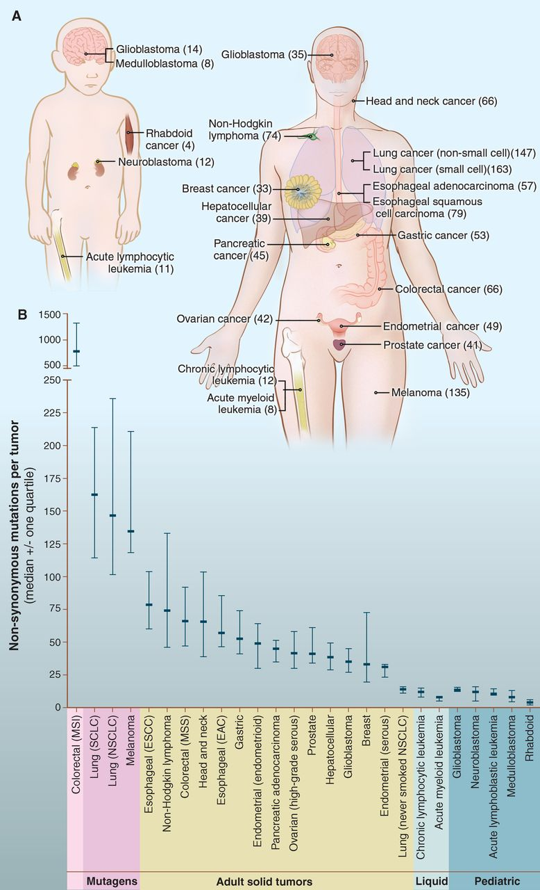

## reviews
* [Vogelstein, B., et al. (2013). "Cancer Genome Landscapes." Science 339(6127): 1546-1558](http://science.sciencemag.org/content/339/6127/1546)

    总结了cancer基因组的遗传变异规律，整理了138个已发现的Mut-Driver genes，并将其分类到12个信号通路，指出了可能大量的Epi-Driver genes未被认知和发现。

